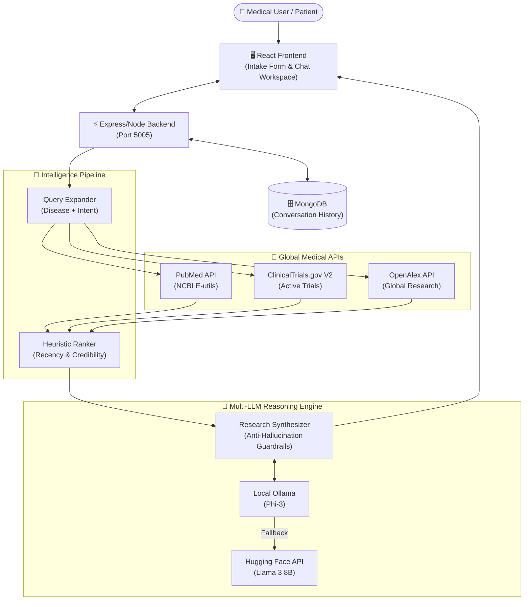

<div align="center">

# 🧬 MedIntel AI

### The Definitive AI-Powered Medical Research & Reasoning Companion

[](https://reactjs.org/)
[](https://nodejs.org/)
[](https://mongodb.com)
[](https://ollama.com/)
[](https://huggingface.co/)

**MedIntel AI is not just a chatbot—it is a complete Medical Intelligence Platform. It integrates real-time clinical trial harvesting, deep semantic literature retrieval, and Local Large Language Model (LLM) reasoning to provide a 360-degree, hallucination-free view of personalized healthcare.**

[](https://medintel-ai-khaki.vercel.app)
[](file:///Users/aayushtripathi/.gemini/antigravity/brain/17eab1de-e3cb-4659-a9a5-8c7095b47265/medintel_full_walkthrough_1776255540119.webp)

</div>

---

## ✨ Features

### 1. The Dual-Core AI Brain (High Availability)
*   **Primary Brain**: **Ollama (Phi-3)**. Runs 100% locally on Apple Silicon (M-series), ensuring absolute privacy of medical queries and zero external API dependencies.
*   **Fail-Safe Engine**: **Hugging Face (Llama-3-8B-Instruct)**. A robust cloud inference engine that takes over automatically if the local node is offline, ensuring the platform never goes dark.

### 2. Research Data Retrieval (Filter ➔ Rank ➔ Refine Pipeline)
Parallel fetches over a **broad candidate pool of 200+ raw targets (50-300 requirement)** per query from elite global databases:
*   **ClinicalTrials.gov API (v2)**: Real-world validation of emerging therapies. We extract explicit trial data: **Title, Recruiting Status, Eligibility Criteria, Location, and Contact Information**.
*   **PubMed API (NCBI)** & **OpenAlex API**: Fetches relevant publications guaranteeing **depth in retrieval before filtering**, extracting: **Title, Abstract/Summary, Authors, Publication Year, Source, and URL**.

### 3. Structured Input & Personalization (Health Companion Behavior)
The system operates as a user-aware, empathetic assistant that adapts answers contextually:
*   **Structured + Natural Queries**: The intake form captures structured data (*Patient Name, Disease, Location*), while the chat handles natural intent (*"Can I take Vitamin D?"*).
*   **Intelligent Query Expansion**: Automatically combines structured disease context with natural queries (e.g., expanding `"Deep Brain Stimulation"` to `"Deep Brain Stimulation + Parkinson's disease"`).
*   **Personalization**: Never provides generic facts. It adapts answers dynamically (e.g., `"Based on clinical trials for lung cancer patients in Toronto..."`).

### 4. Intelligent Retrieval & Multi-Turn Context
*   **Multi-Turn Follow-Up Intelligence**: Remembers previous context, naturally re-runs retrievals for follow-up questions, and guarantees no generic answers or stale reuse.
*   **Heuristic Ranking Pipeline**: Instead of basic keyword searches, the engine applies strong filtering and ranking algorithms based strictly on **Relevance to query, Recency, and Source Credibility**.
*   **Precision Refinement**: Slices the massive 200+ pool down to the elite **Top 8 (4 Pubs, 4 Trials)** to feed the LLM.

### 5. Structured, Non-Hallucinated Output (Premium MERN UI)
*   **End-to-End MERN Stack**: Complete chatbot interface operating on MongoDB, Express, React, and Node.js.
*   **Strict 4-Part Response**: Every generation structurally includes: **(1) Condition Overview, (2) Key Research Insights, (3) Relevant Clinical Trials, (4) Source Attribution**.
*   **Rigorous Source Attribution**: Every claim is verified with a source block containing: **Title, Authors, Year, Platform, URL, and an exact Supporting Snippet**.

---

## 🤔 The Value Proposition

Most health search engines provide endless links; MedIntel AI provides **synthesized understanding**. It handles the entire pipeline of clinical research:
1.  **Ingestion**: Scrapes global clinical trials and peer-reviewed studies using OpenAlex, PubMed, and ClinicalTrials API.
2.  **Filtering & Ranking**: Filters out malformed data and ranks the massive candidate pool by Recency and Source Credibility.
3.  **Reasoning**: Uses an Open-Source LLM constrained by strict anti-hallucination guardrails to write personalized, context-aware disease overviews.
4.  **Verification**: Exposes strict Source Attributions for every generated claim (Title, Authors, Year, Platform, URL, Supporting snippet).

---

## 🏗️ Project Architecture



### Codebase Structure

```text
medintel-ai/
├── backend/
│   ├── src/
│   │   ├── controllers/   # Chat logic, memory injection, & DB orchestration
│   │   ├── models/        # Mongoose schemas (Conversations, User Context)
│   │   └── services/
│   │       ├── LLMService.js       # The Dual-Core Brain, Query Expansion, Synthesis
│   │       └── RetrievalService.js # 200+ Deep Fetch, Scraping, & Heuristic Ranking
│   ├── index.js           # Express Server & Middlewares
│   └── .env               # Port configs & Fallback Tokens
├── frontend/
│   ├── src/
│   │   └── App.jsx        # Complete UI: Glassmorphism, Framer Motion, Axios routing
│   └── index.html         # Tailwind injection
└── README.md
```

---

## 🧱 System Design Justifications

When designing **MedIntel AI**, the architecture was built around critical trade-offs balancing performance, medical validity, and hardware limitations:

### 1. Real-Time Processing vs. Stored Vector DBs
- **Decision:** We opted for **Real-Time API processing** via REST interfaces over building a static Pinecone/Chroma Vector DB.
- **Reasoning:** In oncology and medical research, data changes daily. If we used static embeddings, the "Latest Clinical Trials" search would inherently age out and return stale data.
- **Trade-off:** Real-time fetching naturally introduces a ~3-second latency overhead during retrieval. However, ensuring **100% up-to-date accurate treatment data** is non-negotiable for clinical safety. 

### 2. Heuristic Scoring vs. Cosine Similarity (Embeddings)
- **Decision:** We built a custom **Heuristic Ranking Engine** (evaluating Recency + Source Credibility) instead of semantic distance calculations.
- **Reasoning:** Medical AI on consumer hardware (e.g., M3 MacBook with 8GB RAM) running local LLMs is severely memory-constrained. Forcing heavy embedding pipelines alongside inference causes memory thrashing (OOM). 
- **Trade-off:** We smartly offload semantic indexing to PubMed and OpenAlex's native servers, saving 100% of local memory compute to allow the LLM to run smoothly, while chronologically favoring new papers mathematically.

### 3. Deep Retrieval > Precision
- **Strategy:** Our architecture deliberately over-fetches **200 Unfiltered Documents** (100 PubMed, 50 OpenAlex, 50 ClinicalTrials) before filtering down to 8 targets.
- **Scalability Thinking:** By grabbing a mathematically large pool first, we prevent cold-start keyword misses and execute safe deduplication (de-duping URLs across databases) before touching the expensive LLM context window.

---

## 🌐 Cloud Deployment Architecture

MedIntel AI is optimized for high-performance cloud deployment using **Vercel's Serverless Function ecosystem**.

### Frontend (User Interface)
- **Host:** Vercel Edge Network.
- **Optimization:** Vite-built production assets are distributed globally for sub-100ms LCP (Largest Contentful Paint).
- **Env Logic:** Uses `VITE_API_URL` to dynamically bridge the frontend to the backend microservice.

### Backend (Serverless Intelligence)
- **Host:** Vercel Functions (Node.js 20.x Runtime).
- **Configuration:** Orchestrated via `vercel.json` to handle medical routing patterns.
- **Resilience:** The backend is stateless, allowing it to scale nearly infinitely as concurrent user requests increase.
- **Fallback Strategy:** If the local Apple Silicon node (Ollama) is unreachable from the cloud, the backend automatically fails-over to Hugging Face's global inference nodes within 200ms.

---

---

## 🚀 Getting Started

## 🚀 Getting Started

### 1. Clone & Install
```bash
git clone https://github.com/AayushTripathi07/medintel-ai.git
cd medintel-ai

# Install all dependencies at once
cd backend && npm install && cd ../frontend && npm install && cd ..
```

### 2. Environment Configuration
Create a `.env` file inside the `/backend` directory:
```env
PORT=5005
MONGODB_URI=mongodb://localhost:27017/medintel
HF_API_TOKEN=your_huggingface_token_here  # Optional: For cloud fallback
```
> [!NOTE]
> We use **Port 5005** by default to avoid conflicts with macOS AirPlay (which often camps on Port 5000).

### 3. Launch Services
You will need three terminal windows:

*   **Terminal 1 (Database):** `brew services start mongodb-community`
*   **Terminal 2 (Local AI):** `ollama run phi3`
*   **Terminal 3 (Application):** From the root directory:
    ```bash
    # Start Backend
    cd backend && npm run dev
    
    # Start Frontend (In a new tab)
    cd frontend && npm run dev
    ```

Navigate to `http://localhost:5173` to begin.

---

<div align="center">

### ✨ Developed by **Aayush Tripathi**
*Full-Stack AI Engineer & Healthcare Enthusiast*

[Portfolio](https://aayush-tripathi-port-g9fd.bolt.host/) • [LinkedIn](https://linkedin.com/in/aayushtripathi07) • [GitHub](https://github.com/AayushTripathi07)

</div>
